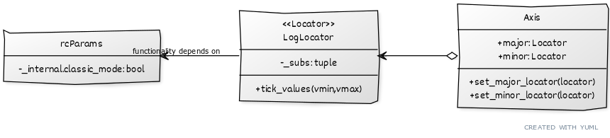
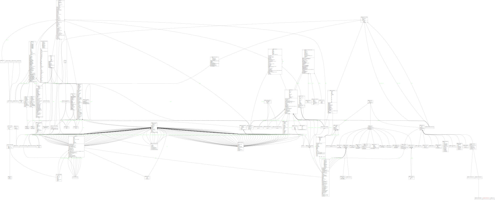

# Report for assignment 4

Issue resolution

## Group 1:

- David Kaméus

- Håvard Alstadheim

- Alexander Binett

- Filippa Leuckfeld

- Carin Bystam

## Project

Name: Matplotlib

URL: https://github.com/matplotlib/matplotlib

Fork URL: https://github.com/haval0/matplotlib

Matplotlib is a python library for creating graphs and plots easily.

## Onboarding experience

- Did you choose a new project or continue on the previous one?
    - We chose to stay with matplotlib as we didn't feel like we had the time to get into the structure of a new project.

- If you changed the project, how did your experience differ from before?
    - We didn't.

## Effort spent

For each team member, how much time was spent in

|Category|Alexander|Carin|David|Filippa|Håvard|
|--------|---------|-----|-----|-------|------|
|1       |    3h   |  3h | 3h  |   1h  |   3h |
|2       |    1h   |  3h | 1h  |       |      |     
|3       |    5h   |  3h | 30m |       |      | 
|4       |    30m  | 20m | 30m |       |      |
|5       |    8h   | 12h | 7h  |       |      |
|6       |    0h   |  1h | 7h  |       |      |
|7       |    3h   |  2h |1.5h |       |      |
|8       |    2h   |  1h |1.5h |       |      |
|9       |         |     |Setup all handled by pip, no manual dependency handling |       |      |

1. plenary discussions/meetings;

2. discussions within parts of the group;

3. reading documentation;

4. configuration and setup;

5. analyzing code/output;

6. writing documentation;

7. writing code;

8. running code;

9. further comments.

For setting up tools and libraries (step 4), enumerate all dependencies
you took care of and where you spent your time, if that time exceeds
30 minutes.

## Overview of issue(s) and work done.

Title: `[Bug]: LogLocator with subs argument fragile. #24092`

URL: https://github.com/matplotlib/matplotlib/issues/24092

When using logarithmic grid axes in plots, ticks don't always show up for some input parameters.
For further detail, see the comments on the issue.

Scope: This affects mostly downstream projects, since it's a front-end bug. As stated in the issue comments, this is narrowed down to the `LogLocator` class generating incorrect (zero) tick locations for these input values, possibly due to how the stride between them is calculated.

## Requirements for the new feature or requirements affected by functionality being refactored

Since the issue concerns resolving a bug, there are mainly three requirements:

#### 1. **Add ticks to the y-axis**
For some input parameters, the method `tick_values` in class `LogLocator` gives the wrong output. The solution should therefore ensure that `tick_values` gives the correct output, so that the y-axis of the logplot is visible. 

#### 2. **Make sure the change doesn't affect intended behavior**
The solution should not affect or change anything else that is not connected to this bug. 

#### 3. **Add tests connected to the problem**
Since no previous tests were connected to the problem, additional tests should be added to check that `tick_values` returns the correct output. This provides more coverage and ensures that similar bugs are caught in the future. 


The tests written correspond to point 3 above. The first test, `test_tick_values_correct`, corresponds to point 2, as it checks that the behavior that occurred before the fix wasn't affected by the fix. The second test, `test_tick_values_not_empty`, corresponds to point 1, as it checks that the function behaves as intended in the scenario it previously did not.

## Code changes

### Patch

The solution is implemented in a fork of the repo. The changes made are visible here:
[View the diff](https://github.com/matplotlib/matplotlib/compare/main...haval0:matplotlib:issue/24092#diff-fd4f809a4a2ca8b97875eff013bac232c55ca3f92f165117f778960ca1795869)

The code now passes the new tests and all of the old tests.

## Test results

Before the fix:
```=================================================================================================== FAILURES ===================================================================================================
__________________________________________________________________________________ TestLogLocator.test_tick_values_not_empty ___________________________________________________________________________________

self = <matplotlib.tests.test_ticker.TestLogLocator object at 0x000001B75272A7A0>

    def test_tick_values_not_empty(self):
        mpl.rcParams['_internal.classic_mode'] = False
        ll = mticker.LogLocator(subs=(1, 2, 5))
        test_value = np.array([1.e-01, 2.e-01, 5.e-01, 1.e+00, 2.e+00, 5.e+00,
                               1.e+01, 2.e+01, 5.e+01, 1.e+02, 2.e+02, 5.e+02,
                               1.e+03, 2.e+03, 5.e+03, 1.e+04, 2.e+04, 5.e+04,
                               1.e+05, 2.e+05, 5.e+05, 1.e+06, 2.e+06, 5.e+06,
                               1.e+07, 2.e+07, 5.e+07, 1.e+08, 2.e+08, 5.e+08,
                               1.e+09, 2.e+09, 5.e+09])
>       assert_array_equal(ll.tick_values(1, 1e8), test_value)

lib\matplotlib\tests\test_ticker.py:260:
_ _ _ _ _ _ _ _ _ _ _ _ _ _ _ _ _ _ _ _ _ _ _ _ _ _ _ _ _ _ _ _ _ _ _ _ _ _ _ _ _ _ _ _ _ _ _ _ _ _ _ _ _ _ _ _ _ _ _ _ _ _ _ _ _ _ _ _ _ _ _ _ _ _ _ _ _ _ _ _ _ _ _ _ _ _ _ _ _ _ _ _ _ _ _ _ _ _ _ _ _ _ _ _

args = (<built-in function eq>, array([], dtype=float64), array([1.e-01, 2.e-01, 5.e-01, 1.e+00, 2.e+00, 5.e+00, 1.e+01, 2.e+...5.e+05, 1.e+06, 2.e+06, 5.e+06,
       1.e+07, 2.e+07, 5.e+07, 1.e+08, 2.e+08, 5.e+08, 1.e+09, 2.e+09,
       5.e+09]))
kwds = {'err_msg': '', 'header': 'Arrays are not equal', 'strict': False, 'verbose': True}

    @wraps(func)
    def inner(*args, **kwds):
        with self._recreate_cm():
>           return func(*args, **kwds)
E           AssertionError:
E           Arrays are not equal
E
E           (shapes (0,), (33,) mismatch)
E            x: array([], dtype=float64)
E            y: array([1.e-01, 2.e-01, 5.e-01, 1.e+00, 2.e+00, 5.e+00, 1.e+01, 2.e+01,
E                  5.e+01, 1.e+02, 2.e+02, 5.e+02, 1.e+03, 2.e+03, 5.e+03, 1.e+04,
E                  2.e+04, 5.e+04, 1.e+05, 2.e+05, 5.e+05, 1.e+06, 2.e+06, 5.e+06,...

C:\Users\David\AppData\Local\Programs\Python\Python310\lib\contextlib.py:79: AssertionError
=========================================================================================== short test summary info ============================================================================================
FAILED lib/matplotlib/tests/test_ticker.py::TestLogLocator::test_tick_values_not_empty - AssertionError:
===================================================================== 1 failed, 7626 passed, 1640 skipped, 13 xfailed in 347.11s (0:05:47) =====================================================================
```
After the fix:
```
========================================================================== 7627 passed, 1640 skipped, 13 xfailed in 310.46s (0:05:10) ==========================================================================
```

Note that we had to change the tests to use `assert_almost_equal` instead of `assert_array_equal` in order for the tests to pass on matplotlib's CI on Linux, 
while the original tests that produced the above output worked correctly on all group members' computers (Mac, Windows, Linux).

A pull request into the upstream repository was created [here](https://github.com/matplotlib/matplotlib/pull/25405).

## UML class diagram and its description

Mainly three classes were relevant to understanding and solving the problem. The relations are shown in this simplified UML diagram:



An automatically generated diagram (more detailed) of some of the relevant classes is also attached below.




### Key changes/classes affected

Only the `LogLocator` class is affected, since the issue is rooted in mathematics, and not a design issue.
A [previous attempt to simplify](https://github.com/matplotlib/matplotlib/commit/a06f343dee3cebf035b74f65ea00b8842af448e9) 
the calculation of the stride between ticks had some unforseen consequences that were not caught by tests. Reverting this change seems to have resolved the issue. It 
was also refactored to an equivalent, more functional style. The review by the matplotlib team later suggested a mathematically correct simplification that could be 
used instead.

## Overall experience

- What are your main take-aways from this project? What did you learn?
    - It's very hard to determine the extent of the changes you might have to implement to resolve an issue unless you are intimately familiar withe code base.
    - This was more of an exercise in code archeology, trying to find at what point the bug was introduced and what other implications reverting to the old way might 
    have. Luckily, it seems it was just an attempt to prettify the code that happened to be mathematically incorrect, but did not directly affect anything else in the 
    code.
    - There were no real issues with the tools used or when communicating with the matplotlib community. 
    They were quite fast at responding with feedback when our PR initially didn't pass the CI checks, though at first it looked like they might start bickering about
    what assertion function should be used in the tests. 
     

- How did you grow as a team, using the Essence standard to evaluate yourself?
    - see the [essence document](./ESSENCE.md)


